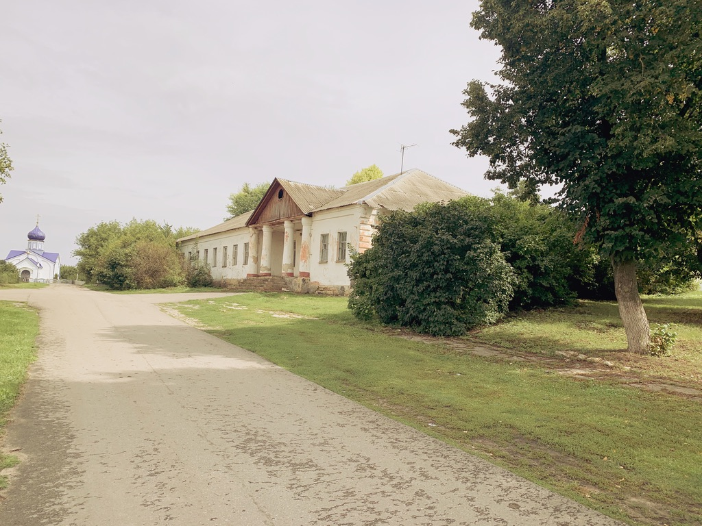

# Чернухина Мария
###### Училасть на строителя, но работаю конструктором в радиоэлектронике. Пришлось разбираться во внутреннем мире компьютеров с нуля и 3d моделировании. Сейчас нахожусь в декретном отпуске и захотелось попробовать себя в мобильной разработке. Полгода пытаюсь сама разобраться со Swift по курсам Алексея Скутаренко и др., но решила, что с помощью Нетологии это будет более эффективным! Увлекаюсь генеалогией
### Навыки:
* Критическое мышление
* Способность к быстрому обучению
* Усидчивость

